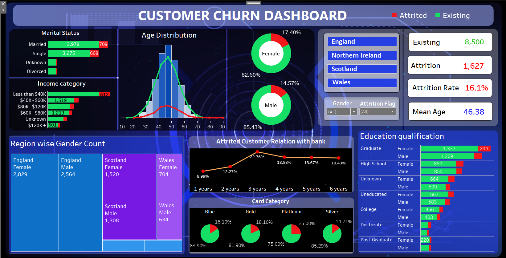

# Customer Churn Analysis (Tableau)

## Introduction

A certain bank in North America, the credit card business of the bank is not performing very well.

## OBJECTIVE:
Analyse the factor affecting the customer attrition.

## Data Preprocessing

1. Summar Statistics
2. Outlier analysis
3. Find missing values
4. Data imputation

## SUMMARY

1. England and Wales has attrition above 16%
2. Platinum card has less customers but still has the most attrition  (25%)
3. Most of the customer use the blue and gold credit card category.
4. The attrition in gold card category is 22% from the second years onwards.
5. The highest income range is 40k - 60k in Females.
6. The highest income range is 80k-120k in Males
7. The attrition in Females (17. 4%)in more than males(14.6%)
8. In northern Ireland the attrition in female is higher in the 5th year and is highest in 3rd year in all the other region
9. Attrition is less in Doctorate and Post Graduate qualification
10. Females taking Platinum card are more likely for attrition

Feel free to explore the interactive visualization on [Tableau Public](https://public.tableau.com/views/Course8-s3/FINALDASHBOARD?:language=en-US&:display_count=n&:origin=viz_share_link) for a more in-depth analysis and insights into the Spotify data.
