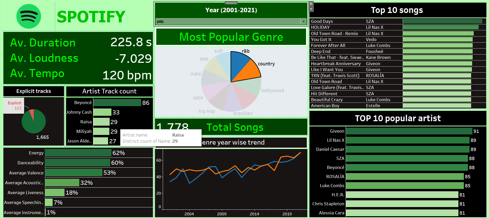

# Spotify Analysis (Python and Tableau)

## Introduction

In the current music landscape, identifying the ideal artists is important for music companies and advertising agencies.

Spotify is a popular digital music streaming service that provides users with access to a vast library of songs, podcasts, and other audio content. Launched in 2008, Spotify has become one of the leading platforms for music consumption globally.

## Data Source

- **Dataset 1: Tracks**
- **Dataset 2: Artists**
- **Source:** Kaggle

## Data Cleaning

1. Dropped useless columns.
2. Converted duration columns to seconds format.
3. Removed unwanted characters.
4. Rectified data types of various columns.
5. Removed all missing values and duplicates separately in both datasets.

## Data Preprocessing

The two datasets, Tracks and Artists, were cleaned and joined using INNER JOIN on the `artist_id` column.

## Conclusion

### For Music Companies

- Best artists are ED SHEERAN and TAYLOR SWIFT in terms of popularity and experience.
- More popular artists result in high track popularity.
- Track Trends:
  - Country and R&B are the most trending genres.
  - Pop is the most popular genre.
  - Explicit tracks are more popular.
  - Best track duration is 190 to 240 seconds.

### For Advertising Companies

- Best artists to get better reach are:
  - Justin Bieber
  - Bad Bunny
  - Drake
  - Ariana Grande
  - Ed Sheeran
  - Taylor Swift

- Most experienced in the field to help in music composition:
  - Taylor Swift
  - J Balvin
  - AR Rahman
  - Pritam

Feel free to explore the interactive visualization on [Tableau Public](https://public.tableau.com/views/SpotifyDashboard_17063687241900/Dashboard2?:language=en-US&:display_count=n&:origin=viz_share_link) for a more in-depth analysis and insights into the Spotify data.
